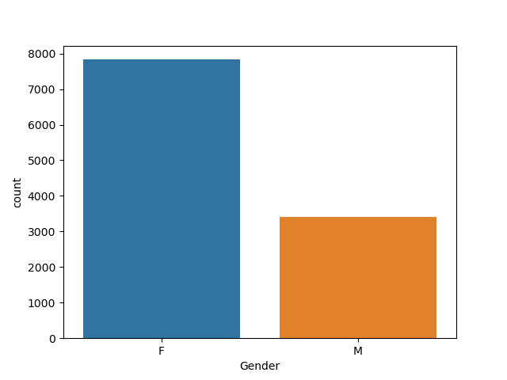
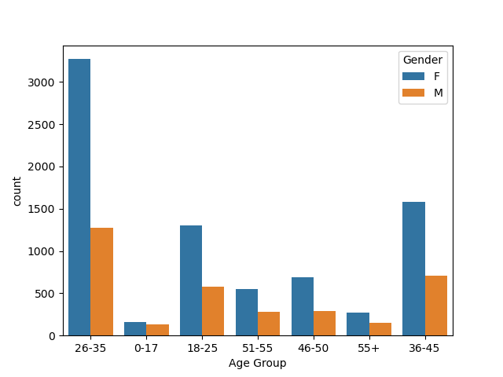
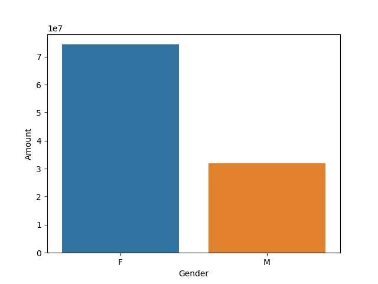
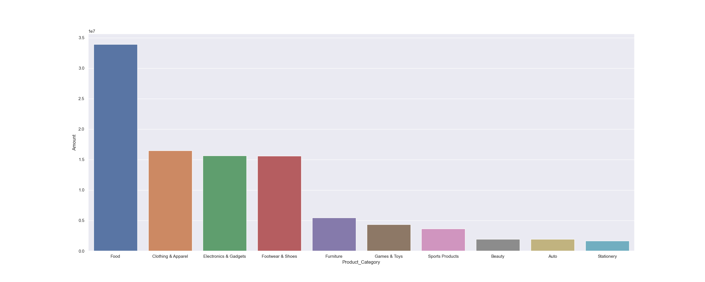
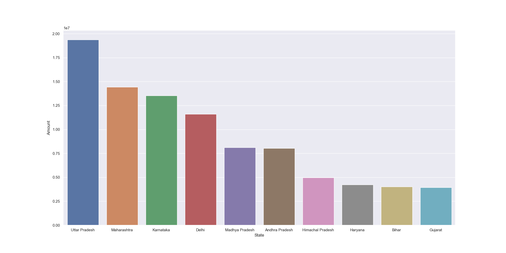
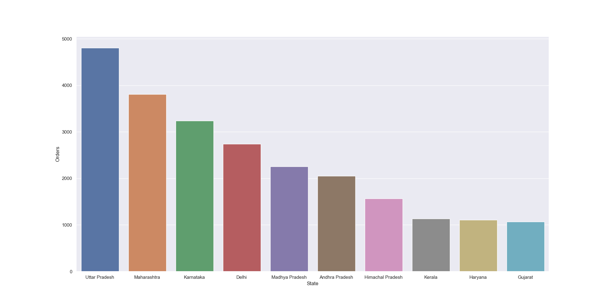

Festival Sales Analysis (EDA Project)

Project Overview

This project performs Exploratory Data Analysis (EDA) on a festival sales dataset to uncover customer purchasing behavior and key business insights.The analysis helps identify target customers, high-performing regions, and popular product categories.

-- Tech Stack

- Python
- Jupyter Notebook
- Pandas
- NumPy
- Matplotlib
- seaborn

-- Data Cleaning & Preprocessing:

- Loaded dataset using Pandas
- Checked structure using ".shape", ".head()", ".info()"
- Handled missing values using ".isnull()" and ".dropna()"
- Removed unnecessary columns
- Renamed columns for clarity
- Converted data types where required
- Generated summary statistics using ".describe()"

---

📊 Exploratory Data Analysis (EDA)

Gender Analysis

- Female customers contribute more to total sales

  Age Group Analysis

- Age group 26–35 years shows highest purchasing activity

State-wise Analysis

- Uttar Pradesh generate maximum orders and revenue

Marital Status Analysis

- Married women are the top buyers

Occupation Analysis

- IT and Healthcare sectors contribute significantly to sales

Product Category Analysis

- Top-performing categories:
  - Food
  - Clothing
  - Electronics

📁 Project Structure

Festival-Sales-Analysis/
│
├── Festival Sales Data.csv
├── Festival analysis.ipynb
├── README.md
└── images/

# images
# gender_analysis

#agegroup

#gender vs amount

#product_amount

#state amount

#state orders

Conclusion
This analysis provides valuable insights into customer demographics and purchasing patterns, helping businesses make data-driven decisions for better marketing and sales strategies.

Future Scope

- Build interactive dashboards (Power BI / Tableau)
- Apply machine learning for sales prediction
- Perform customer segmentation
